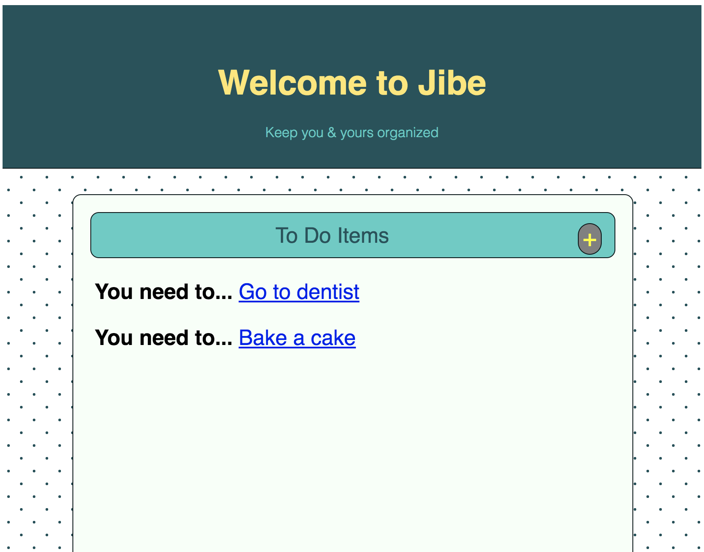

# Jibe Refactor in Ruby

This is a refactor of my Project 1 - Jibe.

Review the original Javascript project here: https://github.com/brwitten/project-1-beth-tucker

In this version of Jibe you can create an account to make To Do items which are rendered on your homepage. From the homepage if you click on a To Do it will take you to a page where you can delete the To Do.

Additional features to add:
+ Finalize auth flow
+ Add ability to update To Dos
+ Add ability to create lists
+ Associate lists with To Dos

3
